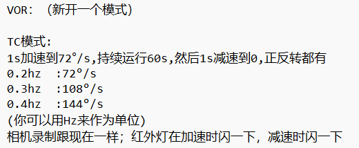

使用伺服电机+7寸屏幕 

7.21
1.增加紧急停止

                                                Start_timer_handler
                                                /                 \     
                            Motor_timer_handler                     NEXT_timer_handler 
                            /           
                    Emg_stop_handler           

## 23/4/16

## <h3>任务

    - 注册#def TC_ID
    - 完成 menu init label
    - 添加handler
    - 在dropdown中添加页面init
    - 在table btn handler中添加正反转
    - 在table refrush中添加tc 的显示（任务列表）
    - 对motor进行更改
        - 完成motor hander
        - 完成motor task => motor_control.c
    - task_change_sever 显示更换

